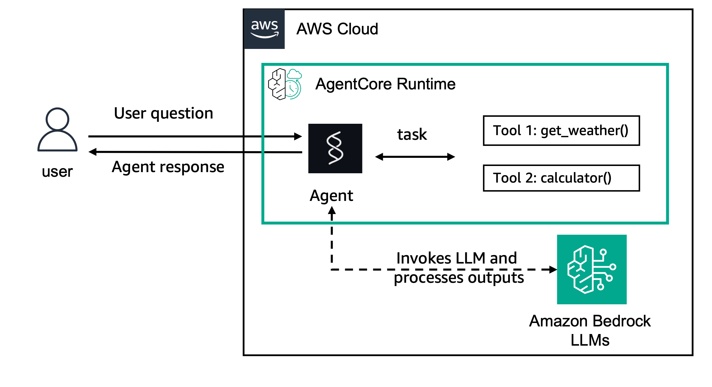

# Strands Agents with Amazon Bedrock on AgentCore New Runtime

## Overview

Deploy a [Strands Agents](https://strandsagents.com/) agent using an Amazon Bedrock model (Claude) to AgentCore New Runtime. This is the simplest path to hosting an agent — write your agent logic, zip it, and deploy with boto3.



```
┌─────────────┐     invoke_agent_runtime()     ┌──────────────────────┐
│   Client    │ ──────────────────────────────▶│  AgentCore runtime   │
│  (boto3)    │◀────────────────────────────── │  ┌────────────────┐  │
│             │         JSON response          │  │  Strands Agent │  │
└─────────────┘                                │  │  + Bedrock LLM │  │
                                               │  └────────────────┘  │
                                               └──────────────────────┘
```

## What New Runtime gives you

Cold starts add significant and *variable* latency. When a new execution environment starts, the microVM is available within milliseconds — but the environment then has to load your agent's code and dependencies before it can serve a request. For direct code deployment that means preparing your zip; for a container image it means pulling from ECR. That load step is the main source of cold-start delay, and because it varies from one start to the next, so does your agent's latency.

New Runtime moves that work to deploy time. AgentCore prepares your execution environment once, snapshots it, and every new environment **resumes from that snapshot**, so the code-loading step drops out of the startup path entirely. 

You select it with one field on `create_agent_runtime`:

```python
platformVersion="V2"
```

**This field must be set explicitly.** Omit it and you do not get New Runtime — the runtime is created on the platform default instead, and nothing in the create response tells you which you got. See [Step 4b](#step-4b-wait-for-ready-and-confirm-new-runtime) for how to confirm.


### When it fits

New Runtime suits agents that are sensitive to cold-start latency, especially with intermittent or bursty traffic that cannot rely on being kept warm. If your agent is under constant load and effectively always warm, you will see less benefit and still pay the slower deploy.

## Prerequisites

- Python 3.10+ (3.12+ recommended)
- [uv](https://docs.astral.sh/uv/getting-started/installation/) installed (for building the arm64 deployment package)
- The `zip` command-line tool (`deploy.py` shells out to it)
- AWS CLI configured with credentials
- boto3 1.43.95 or later
- Access to Amazon Bedrock models (Claude) in your region

No Docker required — deployment uses direct code upload (zip to S3).

Use a virtual environment. On a Homebrew or system Python, a bare `pip install` fails with an `externally-managed-environment` error (PEP 668):

```bash
uv venv --python 3.12
source .venv/bin/activate
uv pip install -r requirements.txt
```

## Step 1: Write the Agent (`agent.py`)

The `bedrock-agentcore` SDK provides `BedrockAgentCoreApp`, which wraps your agent function into an HTTP service. The `@app.entrypoint` decorator tells the SDK which function handles incoming requests.

```python
from bedrock_agentcore.runtime import BedrockAgentCoreApp
from strands import Agent, tool
from strands.models import BedrockModel

# Define tools — these are functions the LLM can call
@tool
def weather(city: str):
    """Get weather information."""
    return "very sunny" if city.lower() == "athens" else "sunny"

model = BedrockModel(model_id="global.anthropic.claude-haiku-4-5-20251001-v1:0")
agent = Agent(model=model, tools=[weather])

app = BedrockAgentCoreApp()

@app.entrypoint
def strands_agent_bedrock(payload):
    """This function is called for every POST /invocations request."""
    response = agent(payload.get("prompt"))
    return response.message["content"][0]["text"]

if __name__ == "__main__":
    app.run()  # Starts HTTP server on port 8080
```

When `app.run()` starts, it creates two endpoints:
- `POST /invocations` — routes to your `@app.entrypoint` function
- `GET /ping` — returns 200 (health check)

You can test locally before deploying:

```bash
uv pip install -r requirements.txt
python agent.py
# In another terminal:
curl -X POST http://localhost:8080/invocations \
  -H "Content-Type: application/json" \
  -d '{"prompt": "What is the weather in Athens?"}'
```

### Writing agent code that is safe to snapshot

This is the one place New Runtime changes how you write an agent, so it is worth understanding before you build something more complex than this sample.

**Your import-time code runs once, before the snapshot is taken — not on every cold start.** Every environment resumed from that snapshot inherits whatever state your module-level code left behind, and many environments can be serving concurrently from the same snapshot. Assume you get no callback in between to fix anything up.

That makes module-level work *good* for anything expensive and reusable, and *wrong* for anything that must be fresh or unique:

| Do at import | Avoid at import | Why |
|:-------------|:----------------|:----|
| Import heavy dependencies | — | Exactly the startup cost New Runtime pre-pays |
| Build model clients, compile graphs | — | Prepared once, reused by every environment |
| — | Open sockets, DB connections, pools | Frozen mid-flight; likely dead on resume. Open them lazily in the entrypoint |
| — | Generate a seed, id, nonce or token | Identical in every resumed environment, permanently. Generate per invocation |
| — | Rely on the `random` module for uniqueness | Its state is captured in the snapshot, so even a **per-request** `random.random()` repeats across environments resumed from the same snapshot. Verified. Use `uuid.uuid4()` or `secrets`, which draw from the OS |
| — | Capture a timestamp or expiry | Reflects snapshot time, not request time, and the gap grows |
| — | Fetch a short-lived credential | Long expired by the time an environment resumes. Let boto3 refresh its own |
| — | Warm a cache you rely on | Contents are frozen and shared. Treat it as cold |

The agent in this sample is snapshot-safe: it builds the model and agent objects at import — the work New Runtime exists to pre-pay — and does no I/O until the entrypoint runs.

If you want to see this for yourself, have an entrypoint return both an import-time value and a freshly generated one, then drive a few dozen concurrent invocations on distinct session ids and count the distinct values you get back. Measured that way on New Runtime: a per-request `uuid.uuid4()` gave 24 distinct values across 24 sessions, while the import-time uuid gave 2 — and the process reported itself several minutes old on its very first request, because it was resumed rather than started.

## Step 2: Create an IAM Execution Role (`deploy.py`)

Every AgentCore runtime needs an IAM role that grants it permissions. The role needs:

- A **trust policy** allowing `bedrock-agentcore.amazonaws.com` to assume it
- An **inline policy** with the full set of permissions the runtime needs

> **Important**: The IAM policy needs more than just `bedrock:InvokeModel`. The runtime also requires CloudWatch Logs (specific log group path), X-Ray (distributed tracing), and CloudWatch Metrics permissions. Without these, the runtime fails to initialize even if your agent code is correct.

`platformVersion` introduces no new IAM actions or resource types — the same role works. See `create_execution_role()` in `deploy.py` for the full policy, and the [runtime permissions documentation](https://docs.aws.amazon.com/bedrock-agentcore/latest/devguide/runtime-permissions.html).

> **Note**: IAM role propagation takes ~10 seconds. The deploy script waits before proceeding.

## Step 3: Build Deployment Package and Upload to S3 (`deploy.py`)

AgentCore runtime uses **direct code deployment** — you zip your Python code and upload it to S3. The zip must include **pre-compiled arm64 dependencies**, not just a `requirements.txt`. The runtime does not run `pip install` at startup.

> **Why arm64?** AgentCore runtime runs on arm64 microVMs. If the zip only contains source files, the runtime can't import the required packages and fails with: *"Runtime initialization time exceeded. Please make sure that initialization completes in 30s."*

We use [uv](https://docs.astral.sh/uv/) to download arm64-compatible wheels:

```bash
uv pip install \
  --python-platform aarch64-manylinux2014 \
  --python-version 3.13 \
  --target deployment_package \
  --only-binary :all: \
  -r requirements.txt

cd deployment_package && zip -r ../deployment_package.zip .
cd .. && zip deployment_package.zip agent.py
# deploy.py then uploads it to s3://<bucket>/<agent-name>/code.zip
```

| Flag | Purpose |
|:-----|:--------|
| `--python-platform aarch64-manylinux2014` | Download wheels for arm64 Linux |
| `--python-version 3.13` | Match the `PYTHON_3_13` runtime |
| `--only-binary :all:` | Only download pre-built wheels (no source compilation) |
| `--target deployment_package` | Install into a local directory, not site-packages |

Packaging is unchanged by `platformVersion` — it governs how the runtime *starts* your code, not how you build it. arm64 is required either way: it is an AgentCore runtime requirement, not something New Runtime introduces.

## Step 4: Create the AgentCore runtime (`deploy.py`)

This is the core API call. `create_agent_runtime` on the **control plane** client (`bedrock-agentcore-control`) registers your agent with AgentCore.

```python
control = boto3.client("bedrock-agentcore-control")

response = control.create_agent_runtime(
    # Name for your runtime (alphanumeric + underscores only, must be unique)
    agentRuntimeName="strands_bedrock_agent",

    # Code deployment — points to your S3 zip
    agentRuntimeArtifact={
        "codeConfiguration": {
            "code": {
                "s3": {
                    "bucket": "agentcore-code-123456789012-us-east-1",
                    "prefix": "my-agent/code.zip",
                }
            },
            "runtime": "PYTHON_3_13",       # Python version (must match uv --python-version)
            "entryPoint": ["agent.py"],      # File to execute
        }
    },

    # IAM role created in Step 2
    roleArn="arn:aws:iam::123456789012:role/agentcore-my-agent-role",

    # Network — PUBLIC means accessible via AWS APIs
    networkConfiguration={"networkMode": "PUBLIC"},

    # Protocol — HTTP for standard request/response
    protocolConfiguration={"serverProtocol": "HTTP"},

    # ─── New Runtime. Must be set explicitly. ───
    platformVersion="V2",

    # Optional
    description="Strands agent with Bedrock model",
)

runtime_id = response["agentRuntimeId"]    # e.g., "abc123"
runtime_arn = response["agentRuntimeArn"]  # e.g., "arn:aws:bedrock-agentcore:us-east-1:123:runtime/abc123"
status = response["status"]                # "CREATING"
```

### `create_agent_runtime` Parameters

| Parameter | Required | Description |
|:----------|:---------|:------------|
| `agentRuntimeName` | Yes | Unique name. Alphanumeric and underscores only — no hyphens |
| `agentRuntimeArtifact` | Yes | Either `codeConfiguration` (zip to S3) or `containerConfiguration` (ECR image) |
| `roleArn` | Yes | IAM execution role ARN. Validated early — a bad role is reported before `platformVersion` is even checked |
| **`platformVersion`** | No | **`"V2"` selects New Runtime. Must be set explicitly** |
| `networkConfiguration` | Yes | `PUBLIC`, or `VPC` with subnets and security groups. The service model lists only three required members, but omitting this one is rejected with `ValidationException: NetworkConfiguration is required` — verified |
| `protocolConfiguration` | No | `HTTP` (default), `MCP`, `A2A`, or `AGUI` |
| `lifecycleConfiguration` | No | `idleRuntimeSessionTimeout` (default 900s) and `maxLifetime` (default 28800s) |
| `environmentVariables` | No | Up to 50 entries. Keeps secrets out of your deployment zip — but the values **are** returned by `get_agent_runtime`, so treat read access to the runtime as read access to them |
| `authorizerConfiguration` | No | `customJWTAuthorizer` for inbound auth (Cognito, Okta, …) |
| `requestHeaderConfiguration` | No | `requestHeaderAllowlist` — which client headers reach your agent |
| `filesystemConfigurations` | No | Persistent storage: `sessionStorage`, `s3FilesAccessPoint`, `efsAccessPoint`, `capacityProviderVolume` |
| `capacityProviderConfiguration` | No | Customer-managed compute. Accepted alongside `platformVersion="V2"`, but **you do not get snapshot-backed startup** — keep the two mutually exclusive |
| `description` | No | Human-readable description |
| `clientToken` | No | Idempotency token. boto3 generates one if omitted |
| `tags` | No | Resource tags. Create only — `update_agent_runtime` does not accept `tags` |

### `codeConfiguration` Fields

| Field | Description |
|:------|:------------|
| `code.s3.bucket` | S3 bucket containing your zip |
| `code.s3.prefix` | S3 key for the zip file |
| `runtime` | `PYTHON_3_10`, `PYTHON_3_11`, `PYTHON_3_12`, `PYTHON_3_13`, `PYTHON_3_14`, or `NODE_22` |
| `entryPoint` | List with the file to execute (e.g., `["agent.py"]`) |


### Step 4b: wait for `READY` and confirm New Runtime

`create_agent_runtime` returns while the runtime is still `CREATING`. There is no botocore waiter for agent runtimes, so poll `get_agent_runtime` yourself. Statuses are `CREATING`, `READY`, `CREATE_FAILED`, `UPDATING`, `UPDATE_FAILED` and `DELETING`.

```python
import time

while True:
    resp = control.get_agent_runtime(agentRuntimeId=runtime_id)
    status = resp["status"]
    if status == "READY":
        break
    if status in ("CREATE_FAILED", "UPDATE_FAILED"):
        raise RuntimeError(resp.get("failureReason", "Unknown error"))
    time.sleep(15)
```

`deploy.py` checks those two statuses explicitly. Matching on the `FAILED` suffix instead would also catch any failure status added later — either way, do not loop on `READY` alone or a failed create will spin until your timeout.

> **This wait takes minutes on New Runtime**, because the snapshot is prepared during create. `deploy.py`'s loop has no timeout so it simply waits — but any automation wrapping it needs its own timeout raised accordingly.

Because create does not echo the field back, confirm New Runtime actually took effect:

```python
runtime = control.get_agent_runtime(agentRuntimeId=runtime_id)
print(runtime.get("platformVersion"))   # "V2"
```

Note the `.get()`. The service returns the **persisted value verbatim, with no default**, so there are three outcomes:

| Read-back | Means | React by |
|:----------|:------|:---------|
| `"V2"` | Confirmed | proceeding |
| any other value | The request did not take effect | failing the deploy |
| **field absent** | **Unknown** — not a specific version | warning, and corroborating another way |

The absent case is real but applies to *older* runtimes rather than fresh creates: verified against 14 pre-existing runtimes in a test account, every one of which omitted the field from the response entirely. A fresh create, by contrast, always persists and reports a value.

So `assert runtime["platformVersion"] == "V2"` is the wrong shape — it raises `KeyError` on absence and treats "cannot confirm" as "failed". `deploy.py` distinguishes all three and only fails on a genuine mismatch. Where it cannot confirm, **duration** is the practical corroboration: preparing a snapshot takes minutes, and you will have noticed.

### A note on `update_agent_runtime`

If you later update this runtime, two things differ from create:

- **It is a full replace, not a patch.** Any updatable parameter you leave out is reset to its default — omit `lifecycleConfiguration` and your session timeouts revert; omit `authorizerConfiguration` and inbound auth is cleared. Read the runtime first and hand every parameter back.
- **The snapshot is re-prepared**, so an update takes minutes even when the platform version is unchanged. There is no cheap no-op update.

## Step 5: Create an Endpoint (`deploy.py`)

A runtime needs at least one **endpoint** before it can receive traffic. The endpoint is what clients invoke.

```python
control.create_agent_runtime_endpoint(
    agentRuntimeId=runtime_id,
    name="default",
)
```

Wait for the endpoint to reach `READY` the same way you waited for the runtime.

> **Budget minutes here too.** Endpoint creation is also slower on New Runtime — measured at 1–3 minutes for this sample. This is easy to miss, because guidance usually mentions only the runtime create/update. `create_agent_runtime_endpoint` has no `platformVersion` field; the platform version travels with the runtime.

## Step 6: Invoke the Agent (`invoke.py`)

Now use the **data plane** client (`bedrock-agentcore`) to send requests. The data plane is unchanged by `platformVersion` — `invoke.py` in this sample is identical to a deployment without New Runtime.

```python
import json, boto3

client = boto3.client("bedrock-agentcore")

response = client.invoke_agent_runtime(
    # The runtime ARN from Step 4
    agentRuntimeArn="arn:aws:bedrock-agentcore:us-east-1:123:runtime/abc123",

    # Your request payload — passed to the @app.entrypoint function
    payload=json.dumps({"prompt": "What is the weather in Seattle?"}).encode("utf-8"),

    # Content negotiation
    contentType="application/json",
    accept="application/json",       # or "text/event-stream" for SSE streaming

    # Optional: reuse a session for multi-turn conversations
    # runtimeSessionId="my-session-123",
)

# Read the response
body = response["response"].read().decode("utf-8")
session_id = response["runtimeSessionId"]  # auto-generated if not provided
print(body)
```

### `invoke_agent_runtime` Parameters

| Parameter | Required | Description |
|:----------|:---------|:------------|
| `agentRuntimeArn` | Yes | ARN of the runtime to invoke |
| `payload` | Yes | Bytes — your request data (passed to `@app.entrypoint`) |
| `contentType` | No | MIME type of the payload (default: `application/json`) |
| `accept` | No | Desired response format — `application/json` or `text/event-stream` |
| `runtimeSessionId` | No | Session ID for multi-turn conversations. **Must be 33–256 characters** — a single `uuid4().hex` is 32 and will be rejected. Auto-generated if omitted |
| `qualifier` | No | Endpoint name (default: `DEFAULT`) |
| `runtimeUserId` | No | Caller identity for session isolation |

## Step 7: Clean Up (`cleanup.py`)

Delete resources in reverse order: endpoints → runtime → S3 artifact → IAM role.

```python
# 1. Delete endpoints
control.delete_agent_runtime_endpoint(agentRuntimeId=runtime_id, endpointName="default")

# 2. Delete runtime
control.delete_agent_runtime(agentRuntimeId=runtime_id)

# 3. Delete S3 code
s3.delete_object(Bucket=bucket, Key="my-agent/code.zip")

# 4. Delete IAM role (remove policies first)
iam.delete_role_policy(RoleName=role_name, PolicyName="agent-policy")
iam.delete_role(RoleName=role_name)
```

There is no snapshot to tear down separately — deleting the runtime disposes of it. The runtime must be in a terminal state before you can delete it, and calling delete while it is still `CREATING` raises `ConflictException`. Since `deploy.py` waits for `READY` before returning, `cleanup.py` can run straight afterwards — it did so cleanly in our runs. Note that each step swallows its own exception and prints `Warning:` rather than stopping, so read the output rather than trusting the final success line.

## Files

| File | Description |
|:-----|:------------|
| `agent.py` | Strands agent with `calculator` and `weather` tools |
| `requirements.txt` | Python dependencies, including `boto3>=1.43.95` — the floor that makes `platformVersion` available |
| `deploy.py` | Full deployment script (Steps 2–5 above), including `platformVersion="V2"` |
| `invoke.py` | Invokes the deployed agent (Step 6) |
| `cleanup.py` | Deletes all resources (Step 7) |

## Quick Start

```bash
uv venv --python 3.12 && source .venv/bin/activate
uv pip install -r requirements.txt

# Test locally
python agent.py

# Deploy to AgentCore New Runtime (several minutes — the snapshot is prepared during create)
python deploy.py

# Invoke the deployed agent
python invoke.py

# Clean up
python cleanup.py
```
