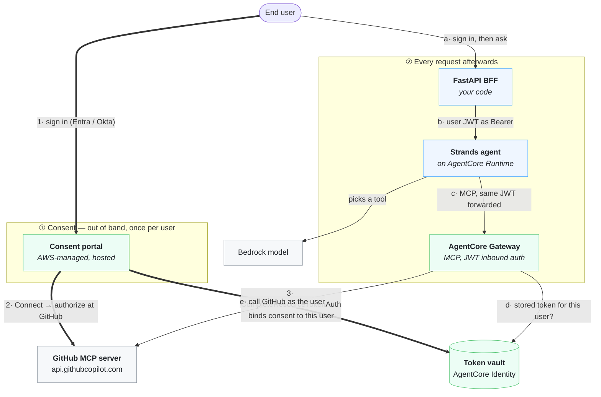

# Managed consent dashboard: an agent reaching GitHub with the user's own authorization

A deployed agent needs to read a user's private GitHub data. GitHub only issues
user-delegated tokens through the OAuth 2.0 authorization code flow (3LO), which
needs a browser, a consent screen, and somewhere to receive the redirect — none
of which an agent running in a container has.

This sample solves that with the **AgentCore consent portal**: a hosted,
AWS-managed dashboard where each end user connects their own GitHub account,
*out of band*, before or independently of any conversation with the agent. The
agent never handles a GitHub credential, and you write no consent UI and no
callback server.

## Architecture

Two independent flows that meet at the **token vault**. Consent happens once, in
the browser, on a page AWS hosts. Every later request reads the result.



Green is AWS-managed, blue is code in this sample, grey is external.

**1–3** is the consent leg. The portal authenticates the user against your IdP,
walks them through GitHub's authorization, and calls `CompleteResourceTokenAuth`
so the resulting token is bound to *that* user. You write no consent UI and no
callback server.

**a–e** is every request afterwards. One token does both inbound hops: the
runtime and the gateway are configured with the same issuer and audience, so the
agent forwards the caller's JWT to the gateway unchanged. At step **d** the
gateway looks up the user's stored GitHub token; if there isn't one it returns a
`-32042` elicitation instead of failing, and the agent replies with the portal
link.

The model's only job is choosing which GitHub tool answers the question. It
never sees a GitHub credential: the gateway holds that, and only because the user
granted it on the portal.

For the same thing as sequence diagrams, including both consent legs and the
`-32042` path, see [ARCHITECTURE.md](ARCHITECTURE.md).

### Five identities to keep straight

Most of the difficulty in this sample is telling these apart. Three live in your
IdP and GitHub; two are AgentCore credential providers that wrap them.

| Identity | Env var | What it is |
| :--- | :--- | :--- |
| **Resource / audience app** | `GATEWAY_CLIENT_ID` | The app every inbound token is audienced at — validated by *both* the runtime and the gateway. Under Entra it is **also** the portal's login client; under Okta the portal gets its own. |
| **Frontend app** | `FRONTEND_CLIENT_ID` | The OIDC client the BFF signs users into. Requests `GATEWAY_SCOPE`, so the token it receives is audienced at the resource app above. |
| **Portal login client** | `PORTAL_CLIENT_ID` | What the consent portal signs users in as. Entra: equal to `GATEWAY_CLIENT_ID` (its `sub` is pairwise per resource). Okta: a separate app (its `sub` is stable per user). |
| **Primary IdP credential provider** | `IDP_PROVIDER_ARN` | AgentCore's wrapper around the portal login client — who the user signs in **as**. Must issue JWTs. Referenced by `idpConfig.credentialProviderArn`. |
| **GitHub outbound provider** | `GITHUB_PROVIDER_ARN` | AgentCore's wrapper around your GitHub OAuth App — what the agent gets consent to act **on**. Referenced by the target's `providerArn`. Vends the callback URL you paste into GitHub. |

The two credential providers are the pair most worth internalising: the primary
IdP answers *who is this user*, the outbound provider answers *what may we do on
their behalf*. GitHub can only ever be the second — it publishes no OIDC
discovery document, so `CreateConsentPortal` rejects it as a primary IdP.

## Prerequisites

**Tooling**

| Requirement | Why |
| :--- | :--- |
| Python 3.10+ | The scripts and the BFF |
| **boto3/botocore ≥ 1.43.88** | First release whose `bedrock-agentcore-control` model carries the consent-portal operations. On anything older every call fails with `'BedrockAgentCoreControlPlaneFrontingLayer' object has no attribute 'create_consent_portal'`, which reads like a missing feature rather than a stale SDK. The scripts check and tell you. |
| Node.js 20+ and `@aws/agentcore` (`npm install -g @aws/agentcore`) | Deploys the runtime |
| AWS CDK 2.x (`npm install -g aws-cdk@2`) + a bootstrapped account | The AgentCore CLI deploys through CDK |
| AWS CLI v2, one credential source | Ambiguous credentials are a common source of confusing failures |

**Accounts and access**

- AWS credentials that can create gateways, gateway targets, OAuth2 credential
  providers, consent portals, IAM roles, and AgentCore runtimes.
- Bedrock model access for Claude Sonnet 4.5 in your region.
- A **GitHub account** that can create an [OAuth App](https://github.com/settings/developers).
- **One identity provider**, either:
  - **Microsoft Entra ID** — a tenant where you can register applications and
    grant admin consent, plus the Azure CLI (`az`, ≥ 2.50) signed in. See
    [IDP_SETUP_ENTRA.md](IDP_SETUP_ENTRA.md).
  - **Okta** — an org with **API Access Management** (custom authorization
    servers; the org server issues opaque tokens, which cannot work here), and
    an admin API token. See [IDP_SETUP_OKTA.md](IDP_SETUP_OKTA.md).
- At least one **test user** who can sign in, assigned to the apps.

All commands run from this directory.

> [!NOTE]
> **Validation status.** Verified end to end against a real AWS account and real
> identity providers — Entra ID and Okta sign-in, portal consent, and live GitHub
> MCP calls through the gateway using the signed-in user's own authorization,
> with the **Bedrock model** choosing the tool. `Who am I on GitHub?` returns the
> caller's identity including their private repository count, which only a
> user-delegated token can see. The optional gateway interceptor was verified
> too; it fires only on the consent elicitation.

## Quick start

### 1. Configure

```bash
cp config.example.env .env
python -m venv .venv && source .venv/bin/activate
pip install -r requirements.txt

# Sanity-check the SDK floor before you create anything:
python -c "import boto3,botocore;print(boto3.__version__,botocore.__version__)"
```

Edit `.env` and set `AWS_REGION`, `FRONTEND_SESSION_SECRET`
(`python -c 'import secrets;print(secrets.token_hex(32))'`), and — for Okta —
`OKTA_DOMAIN` and `OKTA_ADMIN_TOKEN`.

> [!NOTE]
> **One `.env` holds one deployment.** A single file is all you need: `IDP=` in
> it selects the provider, and the deploy scripts write everything else they
> resolve back into it. If you want **both** providers standing at once, give
> each its own file — see [Running both identity providers side by
> side](#running-both-identity-providers-side-by-side).
>
> `.env` and `.env.*` are gitignored; `config.example.env` is the tracked
> template.

### 2. Set up the identity provider

One identity provider serves **three** inbound legs: the runtime's authorizer,
the gateway's authorizer, and the consent portal's own sign-in.
`CreateConsentPortal` validates that the gateway's authorizer and the portal's
credential provider reference the **same OIDC issuer**, so they cannot drift.

Each variant needs **two** applications, not three — the agent forwards the
caller's token to the gateway unchanged, so there is no separate agent identity.

Pick your provider below. Each script is idempotent, writes everything it
resolves into `.env`, and has a manual equivalent in its `IDP_SETUP_*.md`.

<details open>
<summary><b>Microsoft Entra ID</b></summary>

```bash
az login                                   # a tenant where you can register apps
python deploy/00_create_entra_apps.py      # add --rotate-secrets to force new secrets
```

| App it creates | Role |
| :--- | :--- |
| `agentcore-consent-github-gateway` | The **resource** app: the audience of every inbound token, for both the runtime and the gateway. Also the portal's login client. |
| `agentcore-consent-github-frontend` | The OIDC client the BFF signs users in with; web redirect `http://localhost:8000/auth/callback`. |

It also sets, on the resource app: `identifierUris = api://<appId>`, an
`access_as_user` scope, `api.requestedAccessTokenVersion: 2`, a client secret,
and that scope granted **and** admin-consented to itself.

Written to `.env`: `IDP=entra`, `TENANT_ID`, `GATEWAY_CLIENT_ID`,
`PORTAL_CLIENT_ID` (equal to `GATEWAY_CLIENT_ID`), `PORTAL_CLIENT_SECRET`,
`FRONTEND_CLIENT_ID`, `FRONTEND_CLIENT_SECRET`, `IDP_DISCOVERY_URL`,
`IDP_AUDIENCE`, `GATEWAY_SCOPE`, `PORTAL_SCOPES`.

Three Entra specifics that fail *later* if wrong, each checked or set for you:

- **`requestedAccessTokenVersion: 2`.** Without it Entra issues v1-style tokens
  whose `iss` is `sts.windows.net`, which will not match the `/v2.0/` discovery
  document. It surfaces as `Claim 'iss' value mismatch` or `insufficient_scope`
  — both of which read like scope bugs.
- **`IDP_AUDIENCE` is the bare app GUID**, not `api://<GUID>`. A v2 token's
  `aud` holds the application id on its own; the `api://` form is the identifier
  URI, and configuring that instead matches nothing.
- **Scopes must be fully qualified** (`api://<GUID>/access_as_user`). Entra's
  `/authorize` rejects the short name, even though the gateway reads the short
  name out of the issued token's `scp`.

Full detail, including the manual `az` commands: [IDP_SETUP_ENTRA.md](IDP_SETUP_ENTRA.md).

</details>

<details>
<summary><b>Okta</b></summary>

Set these in `.env` first — the script cannot discover them:

```bash
OKTA_DOMAIN=integrator-1234567.okta.com    # NOT the -admin hostname
OKTA_ADMIN_TOKEN=<SSWS token>              # Security → API → Tokens → Create Token
OKTA_AUTH_SERVER_ID=default                # a CUSTOM authorization server
```

```bash
python deploy/00_create_okta_apps.py       # add --rotate-secrets to force new secrets
```

| App it creates | Role |
| :--- | :--- |
| `AgentCore Consent GitHub Frontend` | Confidential web app, authorization code, redirect `http://localhost:8000/auth/callback`. The BFF sends PKCE (S256) regardless, so you can turn on *Require PKCE* without a code change. |
| `agentcore-consent-portal-login` | A **separate** confidential web app for the portal's sign-in, created with a placeholder redirect that step 4 replaces. |

On the authorization server it adds an `access_as_user` scope and one access
policy per app, each admitting `authorization_code` with
`openid profile email access_as_user`.

Written to `.env`: `IDP=okta`, `OKTA_AUTH_SERVER_ID`, `PORTAL_APP_ID`,
`FRONTEND_CLIENT_ID`/`_SECRET`, `PORTAL_CLIENT_ID`/`_SECRET`,
`IDP_DISCOVERY_URL`, `IDP_AUDIENCE`, `GATEWAY_SCOPE`, `PORTAL_SCOPES`.

Four Okta specifics:

- **Pick one spelling of the authorization server and keep it.** The built-in
  server answers to both `default` and its literal `aus…` id, with the same
  issuer — but the gateway and the portal compare discovery URLs as *strings*.
  The script builds every URL from the `OKTA_AUTH_SERVER_ID` you set, so they
  agree; hand-editing one side breaks sign-in with `login_unavailable`. See
  [the callout in Troubleshooting](#troubleshooting-error-ladder).
- **It must be a *custom* authorization server.** The org server
  (`https://<domain>/.well-known/…`) issues **opaque** access tokens and cannot
  host a custom audience or scope, so `CreateConsentPortal` rejects it. Custom
  servers require the **API Access Management** feature; the built-in one is
  named `default`, with audience `api://default`.
- **The access policy must admit `openid`.** The portal always requests it on
  top of `PORTAL_SCOPES`, and a scope the policy does not admit fails
  `/authorize` with a policy error that never names the missing scope. A
  brand-new custom server has *no* policy at all.
- **Assign your test users to both apps.** Okta issues no token to an
  unassigned user; sign-in fails with `User is not assigned to the client
  application`. The script assigns the `Everyone` group where it can.

Unlike Entra, the portal gets its **own** login app. Okta's `sub` is stable per
user across client apps, so consent still binds under the identity the gateway
later resolves.

Full detail, including the manual `curl` calls: [IDP_SETUP_OKTA.md](IDP_SETUP_OKTA.md).

</details>

> [!NOTE]
> Every remaining step takes the same `--entra` or `--okta` flag. It is required
> and has no default: a guessed profile would create — or on teardown, delete —
> resources for the wrong identity provider. Adding a provider is a new
> `deploy/idps/<name>.json` plus a `00_create_<name>_apps.py`; nothing else
> branches on the IdP.

### 3. Create the gateway

```bash
python deploy/01_create_gateway.py --entra
```

MCP protocol, `CUSTOM_JWT` inbound auth over your IdP's discovery URL.

### 4. Create the consent portal

```bash
python deploy/02_create_portal.py --entra
```

Creates the primary IdP credential provider, the execution role, and the
portal; polls until `ACTIVE`; then registers `https://<portalUrl>/callback` on
your IdP app for you.

**Checkpoint A.** Open the printed portal URL and sign in. You should land back
on the portal with an **empty Connections page**. Empty is the result you want
at this stage — you have not attached a target that needs authorization, so the
portal has nothing to offer. Reaching this screen at all exercises the entire
identity chain: the IdP app, the discovery URL, the scopes, the audience, the
gateway authorizer, and the callback registration.

### 5. Create the GitHub OAuth App and its credential provider

Create an [OAuth App](https://github.com/settings/developers) with any
placeholder callback URL, then:

```bash
export GITHUB_CLIENT_ID="…"
export GITHUB_CLIENT_SECRET="…"
python deploy/03_create_github_provider.py --entra
```

The script prints a `callbackUrl`. **Copy it into your GitHub OAuth App's
Authorization callback URL before continuing.** The value is not yours to pick:
the code-for-token exchange happens inside AgentCore, so AgentCore hosts the
redirect endpoint and vends its address.

> This paste is easy to postpone and expensive to forget. Step 6 will succeed
> without it and the target will report `READY`, because nothing validates the
> GitHub side until someone actually authorizes. You find out at **Connect**,
> when GitHub refuses the `redirect_uri` — a symptom that points at the portal
> rather than at the OAuth App.

### 6. Attach the GitHub MCP server as an authorization-code-flow target

```bash
python deploy/04_create_github_target.py --entra
```

### 7. Consent, as a user

Open the portal again. A **GitHub** row appears on the Connections page; choose
**Connect**, authorize at GitHub, and you are returned to
`/connect/callback`, where the portal calls `CompleteResourceTokenAuth` to bind
that consent to *you*.

**Checkpoint B.** The row shows as connected. That proves all three URLs below
are right — which is most of the difficulty in this sample.

> Expect a delay before a new target shows up — that list comes from a cache
> with a lifetime of roughly **5 minutes**. Seeing nothing immediately after
> step 6 is normal, so wait the full five before you go looking for a fault.

### 8. Deploy the agent

```bash
agentcore create --name "$AGENT_RUNTIME_NAME" --project-name "$AGENT_RUNTIME_NAME" \
  --framework Strands --model-provider Bedrock --memory none \
  --build CodeZip --language Python --defaults

# The agent replaces the scaffold's entrypoint.
cp agent/agent.py "$AGENT_RUNTIME_NAME"/app/"$AGENT_RUNTIME_NAME"/main.py

python deploy/05_patch_agentcore_json.py --entra

cd "$AGENT_RUNTIME_NAME"
agentcore validate && agentcore deploy -y -v
agentcore status          # copy the invoke URL
cd ..
```

> [!NOTE]
> Only `main.py` is copied. The scaffold manages dependencies in
> `app/<name>/pyproject.toml` (with a `uv.lock`), not a `requirements.txt`, and
> it already declares everything the agent imports — `bedrock-agentcore`,
> `strands-agents` and `mcp`. [`agent/requirements.txt`](agent/requirements.txt)
> is kept as documentation of that dependency set; you do not copy it in.
> Verified against AgentCore CLI 0.25.0.

Put the invoke URL in `.env` as `AGENT_RUNTIME_INVOKE_URL` **with
`?qualifier=DEFAULT` appended** — without the qualifier every invoke returns
`404 UnknownOperationException`. The URL that `agentcore status` prints has the
runtime ARN percent-encoded in its path; copy it verbatim and append the
qualifier.

Optionally: `python deploy/06_enable_observability.py --entra` sets log
retention and prints the debugging queries.

### 9. Run the frontend

```bash
python frontend/app.py    # http://localhost:8000
```

Sign in as the same user who consented, and ask something like *"Search GitHub
for amazon-bedrock-agentcore-samples and summarize the top result."*

**Checkpoint C.** You get real GitHub results. That proves consent is bound to
the same identity the gateway resolves from your token.

### Optional: steer *every* client to the portal (gateway interceptor)

By default the consent substitution happens in **agent code**: `agent/agent.py`
catches the `-32042` elicitation and replies with the portal URL. That covers
this sample's agent and nothing else. Any other MCP client on the same gateway —
the [MCP Inspector](../../07-centralize-and-govern-your-ai-infrastructure/01-gateway/05-community/gateway-mcp-inspector/),
a coding agent, a colleague's script — still receives the raw AgentCore Identity
authorize URL, and following that directly bypasses the portal's session
binding.

To move the substitution into the gateway instead, so it applies to every
client:

```bash
python deploy/07_deploy_interceptor.py --entra
```

That deploys a Lambda [RESPONSE interceptor](https://docs.aws.amazon.com/bedrock-agentcore/latest/devguide/gateway-interceptors.html)
([`deploy/lambda/interceptor.py`](deploy/lambda/interceptor.py)) which rewrites
`body.error.data.elicitations[*].url` on a `-32042` response. A gateway supports
at most one RESPONSE interceptor.

| Flag | Effect |
| :--- | :--- |
| *(default)* | `--mode rewrite` — inject the portal URL |
| `--mode log-only` | pass through, but log the whole event. Use this if the rewrite stops matching and you need to see the payload shape. |
| `--remove` | detach and delete the Lambda and its role |

#### Configuration you can change

All optional, all in `.env`, all defaulted to something that works. Set none of
them and the interceptor behaves exactly as described above.

| Variable | Default | Why you would change it |
| :--- | :--- | :--- |
| `INTERCEPTOR_TARGET_URL` | `PORTAL_URL` | **The most useful one.** Send users to your own landing page instead of straight to the portal — somewhere you can explain what is about to happen, or add a support link. The portal still gathers the consent; this only changes the first hop the user sees. |
| `INTERCEPTOR_PASS_REQUEST_HEADERS` | `false` | `true` lets the interceptor read request headers. Needed only if you extend the handler to branch on the caller. Leaving it false keeps the caller's JWT out of the interceptor event, and out of CloudWatch in `log-only` mode. |
| `INTERCEPTOR_IDENTITY_URL_HOST` | `bedrock-agentcore` | The guard deciding which URLs may be rewritten. Widen it only if you know why; it is what stops the handler touching an unrelated URL in an elicitation. |
| `INTERCEPTOR_LOG_RETENTION_DAYS` | unset (never expire) | Set it. Lambda creates the log group with no expiry, so interceptor logs otherwise accumulate for the life of the account. |
| `INTERCEPTOR_TIMEOUT_SECONDS` | `10` | The gateway waits on this Lambda on **every** response, so it bounds your tail latency. Keep it small — measured execution is 2–17 ms. |
| `INTERCEPTOR_MEMORY_MB` | `128` | Measured usage is ~37 MB, so 128 is already generous. |
| `INTERCEPTOR_RUNTIME` | `python3.12` | Pin to whatever your org standardises on. |
| `INTERCEPTOR_LAMBDA_NAME` | `<idp>-consent-jit-interceptor` | Match your own naming convention. |
| `INTERCEPTOR_ROLE_NAME` | `<Idp>ConsentInterceptorRole` | Same. |

Changing any of them is just another run of the script — it updates the existing
Lambda and re-applies the gateway wiring in place:

```bash
# e.g. keep 14 days of logs and interpose your own landing page
echo 'INTERCEPTOR_LOG_RETENTION_DAYS=14' >> .env
echo 'INTERCEPTOR_TARGET_URL=https://intranet.example.com/connect-github' >> .env
python deploy/07_deploy_interceptor.py --entra
```

Two things that are **not** configurable, deliberately. The interception point is
`RESPONSE` only, because a REQUEST interceptor cannot see the elicitation. And
the rewrite targets `body.error.data.elicitations[*].url` on error code `-32042`;
if that payload ever changes shape, the handler logs a warning that it matched
nothing rather than silently passing the raw URL through, and `--mode log-only`
is how you inspect the new shape.

Three details worth knowing:

- It runs with `passRequestHeaders: false`. The rewrite needs only the response
  body, so the caller's JWT never enters the interceptor event — or CloudWatch.
- A host guard means it only replaces URLs containing `bedrock-agentcore`; it
  will not touch an unrelated URL that happens to appear in an elicitation.
- `UpdateGateway` is a **full replace**. The script reads the gateway back and
  re-sends `protocolConfiguration`, because dropping it would silently reset
  `supportedVersions` and disable URL-mode elicitation — the very thing the
  interceptor exists to handle.

Agent-side and gateway-side handling compose safely — verified, not assumed. The
interceptor rewrites only the URL; the `-32042` code and its message survive, so
the agent still recognises the elicitation and still renders its own portal
message. Both layers agree on the destination, and neither has to know about the
other. What changes is that clients *other* than this agent now get the portal
URL too.

### 10. See the unconsented path

**Sign in as a second IdP user who has not consented**, and make the same call.
Consent is stored per user, so a colleague's first request hits the unconsented
path while yours keeps working — which is also the honest way to demonstrate it.

Instead of an error you get the portal URL and an explanation: the gateway
returned `-32042` and the agent translated it. Confirm in the logs:

```bash
cd "$AGENT_RUNTIME_NAME" && agentcore logs --since 10m --query "CONSENT_REQUIRED"
```

Have that user Connect on the portal, ask again, and it works.

> [!NOTE]
> The portal's Connections page shows **Connect** for an unconnected provider,
> but once connected its Action column is empty — there is **no Disconnect
> button** to undo it from the UI. Nor is there a revoke API: the data plane has
> no delete-token operation (see the full op list via
> `list(boto3.client("bedrock-agentcore").meta.service_model.operation_names)`).
> So do not plan a demo around toggling one user's consent off and on. Use a
> second user, or reset the stored grant by deleting the gateway target and its
> credential provider and recreating them (in that order — a provider still
> referenced by a target cannot be deleted).

## Sample prompts

Ask these at <http://localhost:8000> once you are signed in and connected. The
target ships with **7 read-only GitHub tools**
([`gateway/github-tools.json`](gateway/github-tools.json)), and the model picks
which one answers the question.

| Prompt | Exercises |
| :--- | :--- |
| `Who am I on GitHub?` | `get_me` — the default prompt, and the clearest proof the call runs as *you* |
| `Find GitHub repositories about bedrock agentcore samples.` | `search_repositories` |
| `Find GitHub users named satveer.` | `search_users` |
| `Search GitHub code for CreateConsentPortal.` | `search_code` |
| `What GitHub teams am I on?` | `get_teams` |

`Who am I on GitHub?` is the one to demo. Two people asking it get two different
answers from the same agent, the same gateway and the same target — which is the
whole point of per-user consent. The reply names the signed-in user and includes
their **private** repository count, which only a user-delegated token can see.

Before consenting (or as a user who has not), any of these returns the portal
prompt instead of data — see [step 10](#10-see-the-unconsented-path).

> [!NOTE]
> GitHub's MCP server exposes 44 tools, but the repo-scoped ones (`owner`/`repo`
> parameters) cannot be called from a standard MCP client through the gateway —
> they require per-call `Mcp-Param-*` headers, and MCP sets headers per
> connection. Only the callable subset ships here, so everything the model is
> offered actually works. See [`gateway/README.md`](gateway/README.md#which-tools-are-here-and-why-only-seven).

## Running both identity providers side by side

The AWS resources for two providers coexist without conflict — every name is
IdP-prefixed (`entra-consent-github-gw` vs `okta-consent-github-gw`, and so on).
What does *not* coexist is `.env`: it is a single flat namespace, so a second
run would overwrite the first's `GATEWAY_ID`, `PORTAL_ID` and the rest.

Give each deployment its own state file with `CONSENT_ENV_FILE`, honoured by
every deploy script and by the frontend:

```bash
# Entra (the default file)
python deploy/01_create_gateway.py --entra
python frontend/app.py

# Okta, side by side
export CONSENT_ENV_FILE=.env.okta
python deploy/00_create_okta_apps.py
python deploy/01_create_gateway.py --okta
CONSENT_ENV_FILE=.env.okta python frontend/app.py
```

Three things to get right when doing this:

- **Give each an `AGENT_RUNTIME_NAME` of its own** (e.g. `consentGithubAgent`
  and `consentGithubOkta`). The name becomes the CDK stack, so reusing it would
  redeploy over the first runtime. Each also gets its own scaffolded project
  folder, and `agentcore/aws-targets.json` inside it pins the target account.
- **Use a separate GitHub OAuth App per provider.** Each variant's credential
  provider vends its own callback URL, and a GitHub OAuth App accepts only one —
  so sharing an app means whichever you registered last is the only one that can
  complete Connect.
- **Only one frontend can hold port 8000.** Stop the other, or change
  `FRONTEND_PORT` *and* register the matching redirect URI with that provider.

Sessions do not leak between them: the frontend stamps each session with a
deployment id and drops one minted by the other deployment, rather than leaving
you apparently signed in with a token the other runtime would reject.

## Three URLs, none interchangeable

Getting these confused is the single most common way this setup fails, and
every failure presents as something else.

| URL | Registered with | Set in | Purpose |
| :--- | :--- | :--- | :--- |
| `https://<portalUrl>/callback` | the **primary IdP app** (Entra: the gateway resource app; Okta: the portal login app) | step 4, automatically | where the **IdP** returns the user after portal sign-in |
| `https://<portalUrl>/connect/callback` | nobody — it is the target's `defaultReturnUrl` | step 6 | where the **outbound provider** returns the user, binding consent to their session |
| `https://bedrock-agentcore.<region>.amazonaws.com/identities/oauth2/callback/<uuid>` | the **GitHub OAuth App** | step 5, by you | where the authorization **code** is delivered |

No trailing slashes. A trailing slash on the first one makes the IdP treat the
callback as unregistered, and the failure surfaces as a generic login error.

## Troubleshooting (error ladder)

| Symptom | Cause | Fix |
| :--- | :--- | :--- |
| `object has no attribute 'create_consent_portal'` | boto3/botocore older than 1.43.88 | `pip install -U 'boto3>=1.43.88'`; the scripts also check and tell you |
| Connections page is empty right after step 6 | That list is served from a cache with a lifetime of about 5 minutes | Give it the full 5 minutes before you start debugging |
| `GET /login` → `/?error=login_unavailable` | The portal could not resolve the gateway's authorizer, **or** the two `discoveryUrl` values differ | `python deploy/01_create_gateway.py --<idp> --reapply-authorizer`; if that does not fix it, make the two discovery URLs byte-identical (see below) |
| `CreateConsentPortal` rejects the gateway | Gateway inbound auth is not JWT, or its issuer differs from the portal's IdP provider | Both must read the same `IDP_DISCOVERY_URL`; re-run step 01 then step 02 |
| `CreateConsentPortal` rejects the IdP provider | That vendor issues opaque tokens — GitHub, Slack, Salesforce, Atlassian, LinkedIn can never be the primary IdP | Use a JWT-issuing IdP; those vendors are outbound-only |
| Portal create retries "execution role not assumable yet" | Normal IAM eventual consistency | Nothing — the script retries for you |
| `/?error=login_failed` right after step 4 | Redirect URI mismatch, most often a trailing slash | Compare the IdP app's redirect URIs against `PORTAL_CALLBACK_URL` exactly |
| `invalid_scope`, or Okta `Policy evaluation failed`, at `/authorize` | A requested scope is not defined or not permitted — **including `openid`** | Add it to the IdP app (Entra) or the AS access-policy rule (Okta). Entra also needs the fully qualified `api://<GUID>/access_as_user` |
| Entra `insufficient_scope`, or `Claim 'iss' value mismatch` | Discovery URL is not the `/v2.0/` one, or the app lacks `requestedAccessTokenVersion: 2` | Re-run `deploy/00_create_entra_apps.py`, which sets both |
| Entra consent-required error although `admin-consent` succeeded | `az ad app permission grant` was skipped, so the permission is recorded on the app but no grant object backs it | Run all three commands in order: `add`, `grant`, `admin-consent` |
| Okta `E0000011 Invalid token provided` on every admin call | `OKTA_ADMIN_TOKEN` expired (30 days of inactivity) or came from another org | Mint a new one: Security → API → Tokens → Create Token |
| Okta `https://https://…` in a URL | `OKTA_DOMAIN` pasted with a scheme | Harmless now — `okta_domain()` normalises scheme, trailing slash and the `-admin` host |
| **Connect** succeeds but tool calls still ask for consent | The portal user and the app user are different accounts | Compare `sub` at `/debug/token` against the id in the portal header |
| Consent appears to do nothing | The target's `defaultReturnUrl` is not exactly `<portalUrl>/connect/callback` | Re-run step 06; it warns when an existing target disagrees |
| GitHub rejects `redirect_uri` at **Connect** | The vended `callbackUrl` from step 05 was never pasted into the GitHub OAuth App | Paste it at github.com/settings/developers — one app per variant |
| No consent screen on reconnect | GitHub does not re-prompt an already-authorized OAuth App | Revoke it under your GitHub authorized apps to see the prompt again |
| A consent flow resumed after a break fails | Authorization URLs and session URIs live 10 minutes | Start over rather than debugging it |
| Signed in as the wrong user, or a 403 after switching IdPs | A session cookie from the other deployment | The frontend drops foreign sessions now; an older cookie needs one visit to `/auth/logout` |
| The model says a tool does not exist (e.g. no repository search) | `tools/list` is **paginated at 30 tools**; reading only the first page hides the rest | Page until `nextCursor`/`pagination_token` is empty — `list_all_tools` in [`agent/agent.py`](agent/agent.py) does this |
| `-32020 header mismatch: missing Mcp-Param-repo header` | That tool takes `owner`/`repo` as header-bound parameters, and MCP sets headers per connection, not per call | Not callable from a standard MCP client. This sample ships only the callable tools; see [`gateway/README.md`](gateway/README.md#which-tools-are-here-and-why-only-seven) |
| Agent replies "GitHub is not connected" although consent exists | Any tool error the model narrates in auth-like terms can trip the consent fallback | Check the runtime logs for the real MCP error before assuming a consent problem |
| `404 UnknownOperationException` from the agent | `AGENT_RUNTIME_INVOKE_URL` missing `?qualifier=DEFAULT` | Append it |
| 401 from the gateway during MCP init | Runtime and gateway `allowedAudience` disagree — the passthrough contract is broken | Re-run `deploy/05_patch_agentcore_json.py` and redeploy |
| Bedrock `ThrottlingException: Too many tokens per day` | The account's daily token quota is zero (common on new accounts) | Raise it via Support for **every** region the cross-region inference profile spans |
| Bedrock `Model use case details have not been submitted` | Anthropic's one-time first-time-use form | Bedrock console → Model catalog → an Anthropic model, or `PutUseCaseForModelAccess` |
| `agentcore deploy` → `Could not assume role … in <other account>` | `<name>/agentcore/aws-targets.json` pins the account from the first deploy | Repoint it and reset `agentcore/.cli/deployed-state.json` |
| `400` on every portal request | The `Host` header is not a valid FQDN | Use `portalUrl` exactly as returned |
| `aws bedrock-agentcore-control get-consent-portal` → `Found invalid choice` | Your AWS CLI bundles its own botocore, older than the consent-portal model | Use the venv's Python, or upgrade the CLI |
| `GetConsentPortal` → constraint violation on the identifier | It takes the portal **id** (`<name>-<10 chars>`) or ARN, not the name | Get the id from `ListConsentPortals` |

Portal authorization **fails closed** and its errors are deliberately
non-diagnostic — a deny and an unreachable dependency look identical from
outside. Read your configuration, not the error string.

> [!IMPORTANT]
> **The two `discoveryUrl` values must match exactly.** The gateway's
> `customJWTAuthorizer.discoveryUrl` and the portal IdP credential provider's
> `oauthDiscovery.discoveryUrl` are compared as strings, not by resolved issuer.
>
> With Okta this bites easily, because a custom authorization server answers on
> **both** `…/oauth2/default/.well-known/openid-configuration` and
> `…/oauth2/<AS_ID>/.well-known/openid-configuration` — same HTTP 200, same
> `issuer` — yet mixing the two forms across the gateway and the provider makes
> the portal fail closed with `login_unavailable`. Verified by putting the pair
> through all four combinations.
>
> The scripts derive both from a single `IDP_DISCOVERY_URL`, so they agree by
> construction. If you hand-edit one side, change the other too and re-run
> step 01.

## Teardown

Reverse order. The runtime first, because it is a CDK stack:

```bash
cd "$AGENT_RUNTIME_NAME"
agentcore remove agent --name "$AGENT_RUNTIME_NAME" -y && agentcore deploy -y -v
cd ..

python deploy/teardown.py --entra --clean-env
python deploy/00_delete_entra_apps.py --yes     # optional
```

`teardown.py` deletes the targets, the GitHub provider, the portal (**waiting
for that delete to finish** — removing its IdP provider or execution role from
under a still-`DELETING` portal is how you get a stuck delete), then the IdP
provider, the roles and the gateway. It verifies and reports survivors; some
AgentCore deletes are async, so re-run it if it complains. `--verify-only`
checks without deleting.

Your GitHub OAuth App is yours to delete at
<https://github.com/settings/developers>.

## Repository layout

```
07-consent-portal-auth-code-flow-targets/
├─ README.md                     # this file — quick start, troubleshooting, teardown
├─ ARCHITECTURE.md               # sequence diagrams: both consent legs, the -32042 path
├─ IDP_SETUP_ENTRA.md            # Entra setup, automated + manual, and why each value
├─ IDP_SETUP_OKTA.md             # Okta setup, automated + manual (custom AS, policies)
├─ config.example.env            # tracked template; copy to .env
├─ requirements.txt              # deploy scripts + the BFF
│
├─ deploy/                       # numbered, idempotent, each takes --entra | --okta
│  ├─ _common.py                 #   .env state, IdP profile loading, boto3 floor check
│  ├─ idps/entra.json            #   IdP *shape* (vendor, discovery-URL rule); values live in .env
│  ├─ idps/okta.json
│  ├─ 00_create_entra_apps.py    #   2 Entra apps, scopes, v2 tokens, admin consent
│  ├─ 00_create_okta_apps.py     #   2 Okta apps, custom scope, access policies
│  ├─ 00_delete_*_apps.py        #   IdP teardown (run last)
│  ├─ 01_create_gateway.py       #   service role + CUSTOM_JWT gateway (+ --reapply-authorizer)
│  ├─ 02_create_portal.py        #   IdP provider + exec role + CreateConsentPortal + callback
│  ├─ 03_create_github_provider.py #  GithubOauth2 provider; prints the callback to paste
│  ├─ 04_create_github_target.py #   MCP target, schema upfront, AUTHORIZATION_CODE
│  ├─ 05_patch_agentcore_json.py #   runtime inbound JWT + env vars
│  ├─ 06_enable_observability.py #   log retention + debugging queries
│  ├─ 07_deploy_interceptor.py   #   OPTIONAL: gateway-wide elicitation rewrite
│  ├─ lambda/interceptor.py      #   the RESPONSE interceptor handler
│  └─ teardown.py                #   reverse-order delete + verify (--clean-env)
│
├─ agent/
│  ├─ agent.py                   # Strands agent; forwards the caller's JWT, handles -32042
│  └─ requirements.txt           # documents the dependency set (the CLI scaffold owns deps)
│
├─ frontend/                     # FastAPI BFF — one app, one adapter per IdP
│  ├─ app.py                     #   routes, session, agent invocation (IdP-agnostic)
│  ├─ auth_entra.py              #   MSAL confidential client
│  ├─ auth_okta.py               #   authlib, auth code + PKCE
│  └─ templates/                 #   base, home (with the demo diagram), result, token
│
└─ gateway/
   └─ github-tools.json          # GitHub MCP tool schema, supplied upfront to the target
```

Generated at deploy time and gitignored: `.env` (and `.env.*`), `.venv/`, and one
scaffolded project folder per runtime (`consentGithubAgent/`, `consentGithubOkta/`).

## Documentation

- [Consent portal overview](https://docs.aws.amazon.com/bedrock-agentcore/latest/devguide/identity-consent-portal.html)
  · [prerequisites](https://docs.aws.amazon.com/bedrock-agentcore/latest/devguide/identity-consent-portal-prerequisites.html)
  · [execution role](https://docs.aws.amazon.com/bedrock-agentcore/latest/devguide/identity-consent-portal-execution-role.html)
  · [configuring a target](https://docs.aws.amazon.com/bedrock-agentcore/latest/devguide/identity-configure-consent-portal-target.html)
- [OAuth 2.0 authorization URL session binding](https://docs.aws.amazon.com/bedrock-agentcore/latest/devguide/oauth2-authorization-url-session-binding.html)
  and [`CompleteResourceTokenAuth`](https://docs.aws.amazon.com/bedrock-agentcore/latest/APIReference/API_CompleteResourceTokenAuth.html)
- [Gateway outbound auth](https://docs.aws.amazon.com/bedrock-agentcore/latest/devguide/gateway-outbound-auth.html)
  and [adding gateway targets](https://docs.aws.amazon.com/bedrock-agentcore/latest/devguide/gateway-building-adding-targets.html)
- [Outbound credential providers](https://docs.aws.amazon.com/bedrock-agentcore/latest/devguide/identity-outbound-credential-provider.html)

## Security notes

- **Client secrets** are read from the environment or prompted for with
  `getpass`, never taken on the command line, and never printed. They land in
  `.env` — or `.env.<name>` if you use `CONSENT_ENV_FILE` — which is gitignored
  (both patterns) but **plaintext**. Treat these as a sandbox, not a template
  for production secret handling. Running two providers side by side means two
  full sets of secrets on disk, so mind what you copy between files.
- **The Okta admin token is setup-only.** `OKTA_ADMIN_TOKEN` is used by
  `00_create_okta_apps.py` and by step 02's callback registration, and never at
  runtime. You can blank it once setup is done. Okta expires API tokens after
  30 days of inactivity, so a stale one fails every admin call with
  `E0000011 Invalid token provided`.
- **GitHub scopes** (`repo user workflow`) are broad for a tutorial. Trim them
  in [`deploy/03_create_github_provider.py`](deploy/03_create_github_provider.py)
  and [`deploy/04_create_github_target.py`](deploy/04_create_github_target.py).
- **The IdP client secret expires** (one year, as issued here). A long-lived
  deployment needs a rotation plan.
- **`/debug/token`** displays the user's access token to help you verify the
  audience and subject claims. It requires a signed-in session, but it is still a
  debug route — remove it if you reuse the frontend.
- **The BFF session cookie is tuned for `http://localhost`.** It is signed,
  `HttpOnly` and `SameSite=Lax`, and it carries the user's access token — but it
  is deliberately *not* `Secure`, because that flag would stop the cookie being
  sent over plain HTTP and break the sample. Serving this anywhere other than
  localhost means terminating TLS and adding `https_only=True` to the
  `SessionMiddleware` in [`frontend/app.py`](frontend/app.py).
- **No statement in either IAM role uses `"Resource": "*"`.** The AgentCore
  Identity actions (`GetWorkloadAccessToken*`, `GetResourceOauth2Token`,
  `CompleteResourceTokenAuth`) *do* support resource-level permissions, so they
  are scoped to this account and region:

  ```
  arn:aws:bedrock-agentcore:<region>:<account>:token-vault/*
  arn:aws:bedrock-agentcore:<region>:<account>:workload-identity-directory/*
  ```

  Both families are listed because the [service reference](https://servicereference.us-east-1.amazonaws.com/v1/bedrock-agentcore/bedrock-agentcore.json)
  marks none of the supported resource types as required. The vault and directory
  **ids** stay wildcarded on purpose: AgentCore owns those names and mints a
  workload identity per runtime and gateway, so pinning today's `default` would
  break as soon as the service picks something else. The remaining statements are
  pinned to a single gateway, credential-provider, log-group or secret ARN, and
  the portal role's Secrets Manager read additionally requires
  `owningService = bedrock-agentcore-identity`.

  To go further, these actions also accept condition keys —
  `bedrock-agentcore:InboundJwtClaim/{iss,aud,sub,client_id,scope}` and
  `bedrock-agentcore:userid` — so you can require, say, a specific token issuer
  and audience. Not used here, because the correct values differ per tenant and a
  wrong one fails closed in a way that is hard to diagnose from the portal.
- **Names are user-facing.** Whatever you call the target and the outbound
  provider is what end users read on the Connections page. `github-mcp-server`
  suits a sample; outside one, choose wording that means something to the person
  deciding whether to grant access.
