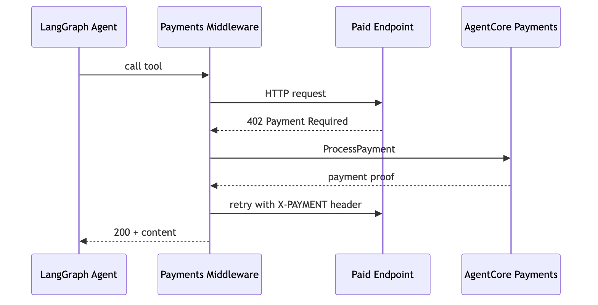

# Tutorial 01 — Agents, Payments, and Limits

| Information         | Details                                                            |
|:--------------------|:-------------------------------------------------------------------|
| Tutorial type       | Conversational                                                     |
| Agent type          | Single, payment-enabled                                            |
| Frameworks          | Strands Agents, LangGraph, OpenAI Agents SDK                       |
| LLM models          | Anthropic Claude Sonnet 4.6 and OpenAI GPT-5.5 on Amazon Bedrock   |
| Components          | `PaymentManager`, payment integrations, x402 endpoints, sessions   |
| Complexity          | Easy                                                               |

> **Reads** the shared `.env` from Tutorial 00 (`PAYMENT_MANAGER_ARN`, `USER_ID`, `INSTRUMENT_ID`;
> `NETWORK` optional). **Does** run local agents that create a per-run spending session
> in-code with the SDK and pay x402 endpoints automatically under a budget — nothing new is deployed.
> → [How the pieces fit together](../README.md#cli-vs-sdk)

## Overview

The shared payment stack — payment manager, connector, IAM roles, and a funded wallet (instrument) —
is already provisioned from [Tutorial 00](../00-setup-agentcore-payments/). Here your agent code
uses the AgentCore SDK to open a **spending session** (a per-request budget you set per user) and pay
each HTTP 402 automatically. You run three agents that call x402-protected endpoints under a
`maxSpendAmount` budget:

- **Strands** — `AgentCorePaymentsPlugin` intercepts 402 responses from the `http_request` tool and
  pays automatically. Zero payment logic in the agent code.
- **LangGraph** — `AgentCorePaymentsMiddleware` intercepts a 402, calls
  `PaymentManager.generate_payment_header()`, and retries with the proof header. The LLM never sees
  the 402.
- **OpenAI Agents SDK** — a small framework-neutral `x402_fetch` function tool handles the same
  402 → payment proof → retry flow while GPT-5.5 runs through Amazon Bedrock's OpenAI-compatible
  endpoint.

All three scripts read the same `PaymentManager` ARN and instrument from `.env`, and work with either
wallet provider (Coinbase CDP or Stripe/Privy) and either network (Ethereum Base Sepolia or Solana
Devnet) — the only thing that changes is the instrument ID from Tutorial 00.

> **Billable resources.** Each successful x402 call spends testnet USDC from your funded wallet and
> is metered by AgentCore payments. See [AgentCore pricing](https://aws.amazon.com/bedrock/agentcore/pricing/).

> **Testnet only.** Use Base Sepolia (network `ETHEREUM`) or Solana Devnet (network `SOLANA`) with
> free USDC from [faucet.circle.com](https://faucet.circle.com/). Testnet USDC has no monetary value.

> **Supported regions:** `us-east-1`, `us-west-2`, `eu-central-1`, `ap-southeast-2`.

## Architecture

### Strands


```
Agent (Strands + http_request tool)
  │
  ├─► http_request GET https://x402-test.genesisblock.ai/api/weather
  │                         │
  │                   Server returns HTTP 402 (x402 payment required)
  │                         │
  │         AgentCorePaymentsPlugin intercepts 402
  │                         │
  │         ProcessPayment ─► budget check ─► sign tx ─► return proof
  │                         │
  │         Plugin retries http_request with X-PAYMENT header
  │                         │
  ├─► 200 OK ─ agent receives paid content
  │
  └─► Agent summarizes results for the user
```

### LangGraph

`AgentCorePaymentsMiddleware` sits between the agent and the tool: it auto-registers a payment-aware
`http_request` tool, catches the 402 the endpoint returns, buys a payment proof from AgentCore
Payments, and retries the request with the `X-PAYMENT` header — so the agent (and the LLM) only ever
sees the final `200`.



## Prerequisites

- **Tutorial 00 completed** — the shared `.env` (one directory up, at
  [`00-getting-started/.env`](../)) must contain `PAYMENT_MANAGER_ARN`, `USER_ID`, and
  `INSTRUMENT_ID` (`NETWORK` is optional and defaults to `ETHEREUM`). The scripts read these via
  `utils.load_tutorial_env()`.
- **Funded wallet with delegated signing granted** — the instrument's wallet must hold testnet USDC
  ([faucet.circle.com](https://faucet.circle.com/)) and have delegated signing enabled (done in
  Tutorial 00). Without it, the 402 payment step fails.
- **Python 3.10+** and AWS credentials configured (`aws sts get-caller-identity`).
- **OpenAI GPT-5.5 access on Amazon Bedrock** for the optional OpenAI example. It defaults to
  `us-east-1` and uses AWS credentials, not an OpenAI API key.
- **Python deps:**
  ```bash
  pip install -r requirements.txt
  ```
- **AgentCore CLI (optional)** — only needed for the inspect step below
  (`agentcore status --type payment`). Install with `npm install -g @aws/agentcore` (Node.js 20+).
  Everything the agents do in this tutorial is pure SDK.

## Walkthrough

### Step 1 — Confirm Tutorial 00 populated the shared `.env`

The agents load their configuration from the shared `.env` one directory up. Confirm the keys they
read are present:

```bash
grep -E 'PAYMENT_MANAGER_ARN|INSTRUMENT_ID|USER_ID|NETWORK' ../.env
```

If any of `PAYMENT_MANAGER_ARN`, `INSTRUMENT_ID`, or `USER_ID` is missing, re-run Tutorial 00
([`../00-setup-agentcore-payments/`](../00-setup-agentcore-payments/)) to write the resource IDs
before continuing. (`NETWORK` is optional.)

### Step 2 — Run the Strands agent

```bash
python strands_payment_agent.py
```

The script loads the manager ARN and instrument from `.env`, creates a per-run spending session
in-code with the SDK (`manager.create_payment_session(...)`, budget set by the `SESSION_BUDGET`
constant near the top of the script), wires up `AgentCorePaymentsPlugin`, and asks the agent to fetch
the paid weather endpoint — the plugin settles each HTTP 402 automatically within the session budget.
(This is the flow in the **Strands Payment Flow** diagram under [Architecture](#architecture) above.)

### Step 3 — Run the LangGraph agent

```bash
python langgraph_payment_agent.py
```

Same `.env` and instrument, but this script shows the **minimal** setup: it never calls
`create_payment_session`. Instead it sets `auto_session=True` on the `AgentCorePaymentsMiddleware`,
so the session is created lazily on the first 402, capped at `auto_session_budget` (the
`SESSION_BUDGET_USD` constant near the top). The middleware auto-registers a payment-aware
`http_request` tool and runs a streaming agent against the x402 endpoint `/api/market-news`,
settling each 402 automatically.
(This is the flow in the **LangGraph Payment Flow** diagram under [Architecture](#architecture) above.)

### Step 4 — Run the OpenAI Agents SDK agent

```bash
python openai_payment_agent.py
```

This variant creates a $1.00 session, exposes `openai_x402_tool.py` through the OpenAI Agents SDK's
`function_tool()`, and asks GPT-5.5 on Amazon Bedrock to summarize the paid market-news endpoint.
The helper accepts HTTPS GET requests to public addresses, pins the validated IP for both requests
while preserving TLS hostname verification, and disables redirects and environment proxies.
It handles the x402 challenge, generates **one payment proof**, and replays the GET once with a
fresh HTTP client. A successful run reports `payment_made: true` and HTTP 200.

There is no payment retry loop: a repeated 402, merchant error, or lost reply must not create another
payment automatically. `payment_made: null` means the outcome is unknown; inspect the session's spend
before deciding whether to try again. A budget rejection reports `payment_made: false`. The former
`X402_MAX_PAYMENT_ATTEMPTS` setting is no longer used.

The OpenAI SDK's default trace exporter is disabled because this example authenticates only to
Bedrock. AgentCore's separately configured CloudWatch/OpenTelemetry observability remains available.

## Try different budgets (payment limits)

Budget enforcement lives on the session. Change the budget by editing the constant near the top of
the script, then re-run the agent. For example, set a tiny budget smaller than the API cost:

```python
# strands_payment_agent.py — creates the session in-code
SESSION_BUDGET = {"maxSpendAmount": {"value": "0.0001", "currency": "USD"}}

# langgraph_payment_agent.py — session is auto-created by the middleware
SESSION_BUDGET_USD = "0.0001"
```

```bash
# OpenAI — override without editing source
PAYMENT_SESSION_BUDGET=0.0001 python openai_payment_agent.py
```

Re-run the agent — the payment is rejected because the $0.0001 budget is smaller than the API cost.
Enforcement is structural (service-level), not agent logic.

The examples show two ways to set the budget. **LangGraph** takes the minimal path: the
middleware creates the session on the first 402 (`auto_session=True`), so `auto_session_budget` — fed
from `SESSION_BUDGET_USD` — is the only budget knob, and there is no session ID to manage. **Strands**
and **OpenAI** open the session in-code with the SDK, which gives you the session handle to inspect
or reuse:

```python
sess = manager.create_payment_session(
    user_id=USER_ID,
    limits={"maxSpendAmount": {"value": "0.0001", "currency": "USD"}},
    expiry_time_in_minutes=60,
)
# Omit `limits` entirely for an uncapped session (spend tracked but not capped).
# Read a session's remaining budget in-code with the SDK:
sess = manager.get_payment_session(user_id=USER_ID, payment_session_id=SESSION_ID)
print(sess["availableLimits"]["availableSpendAmount"])
```

This is the workshop's division of labor: infrastructure is provisioned once with the AgentCore CLI,
the per-user session is created either in-code with the SDK or automatically by the middleware, and
the framework integration or x402 function tool handles the pay-and-retry at request time.

## What the agents do

Each script's default run does the **happy path** — one paid call under a $1.00 session. Strands calls
the weather endpoint; LangGraph and OpenAI call `/api/market-news`. Exercise the remaining scenarios
by changing the relevant budget setting and re-running, as described in
[Try different budgets](#try-different-budgets-payment-limits) above:

| Scenario | How to run it | What it shows |
|----------|---------------|---------------|
| Happy path | Default run ($1.00 session) | The 402 → sign → retry → 200 flow, fully automatic |
| OpenAI Agents SDK | `python openai_payment_agent.py` | Framework-neutral x402 tool with GPT-5.5 on Amazon Bedrock |
| Budget session | Set the budget to `$0.50`, re-run | Remaining spend after a paid call (`get_payment_session`) |
| Budget exceeded | Set the budget to `$0.0001` (below API cost), re-run | ProcessPayment rejects the payment at the infra level |
| Built-in tools (Strands) | Default run — agent answers "how much budget is left?" | Plugin tools `get_payment_session` / `get_payment_instrument` / `list_payment_instruments` |
| Uncapped session (Strands) | Create a session with no `limits` | Spend tracked but not capped — for trusted agents only |

Budget enforcement is cumulative and server-side: the service sums all `ProcessPayment` calls in a
session and rejects the next payment once `maxSpendAmount` would be exceeded, or once the session
expires. The agent role cannot raise its own budget.

## Inspect / verify

```bash
# Live view of managers, connectors, and payment status (requires the AgentCore CLI).
# `status --type payment` reads a scaffolded project's config — run it from the Tutorial 00 project dir:
cd ../00-setup-agentcore-payments/PaymentSetup && agentcore status --type payment

# Confirm the keys the scripts read are present
grep -E 'PAYMENT_MANAGER_ARN|PAYMENT_CONNECTOR_ID|INSTRUMENT_ID|USER_ID|NETWORK' ../.env
```

The scripts read a specific session's remaining spend in-code with the SDK
(`manager.get_payment_session(...)`). Do the same from a quick Python one-liner:

```python
from bedrock_agentcore.payments import PaymentManager

manager = PaymentManager(payment_manager_arn=PAYMENT_MANAGER_ARN, region_name=REGION)
sess = manager.get_payment_session(user_id=USER_ID, payment_session_id=SESSION_ID)
print(sess["availableLimits"]["availableSpendAmount"])   # remaining spend
```

Check the funded wallet's balance with the SDK (`chain` and `token` are required; map `NETWORK` to the
chain):

```python
from bedrock_agentcore.payments import PaymentManager

manager = PaymentManager(payment_manager_arn=PAYMENT_MANAGER_ARN, region_name=REGION)
chain = "BASE_SEPOLIA" if NETWORK == "ETHEREUM" else "SOLANA_DEVNET"
bal = manager.get_payment_instrument_balance(
    payment_connector_id=PAYMENT_CONNECTOR_ID,
    payment_instrument_id=INSTRUMENT_ID,
    chain=chain,
    token="USDC",
    user_id=USER_ID,
)
print(bal["tokenBalance"]["amount"] / 1_000_000, "USDC")   # micro-USDC → USDC
```

## Troubleshooting

| Symptom | Cause | Fix |
|---|---|---|
| `load_tutorial_env()` raises `FileNotFoundError`, or `PaymentManager` fails on a `None` ARN | Tutorial 00 didn't finish — `../.env` is missing or has no resource IDs | Re-run Tutorial 00 to write the resource IDs to `../.env` |
| Agent gets 402 but payment fails | Delegated signing not granted for the wallet | Coinbase CDP: enable Delegated Signing in CDP Portal → Wallets → Embedded Wallet → Policies. Stripe/Privy: open the Privy reference frontend at `http://localhost:3000`, log in as `LINKED_EMAIL`, choose **Connect agent** |
| Budget exceeded immediately | Session budget below API cost, or wallet has insufficient USDC | Expected for the $0.0001 demo; otherwise fund the wallet at [faucet.circle.com](https://faucet.circle.com/) |
| `invalid_exact_evm_transaction_failed` / settlement failure | Transient on-chain failure (e.g. back-to-back payments) | Retry — funds are not debited on a failed attempt |
| `agentcore: command not found` | CLI not installed (only needed for the inspect step) | `npm install -g @aws/agentcore` |
| OpenAI model request is denied | GPT-5.5 is unavailable in the selected region or AWS credentials are expired | Refresh AWS authentication and check `BEDROCK_OPENAI_MODEL_REGION` / `BEDROCK_OPENAI_MODEL_ID` |

## Clean Up

This tutorial provisions nothing durable — payment **sessions expire automatically** at
`expiryTimeInMinutes`, so there is nothing to tear down here. The shared manager/connector/instrument
and any deployed runtimes are cleaned up in their owning tutorials. To remove the shared stack from
Tutorial 00 (delete the per-user instrument with the SDK first — see Tutorial 00's Clean Up):

```bash
cd ../00-setup-agentcore-payments/PaymentSetup
agentcore remove payment-connector --manager MyPaymentManager --name MyCoinbaseConnector -y
agentcore remove payment-manager --name MyPaymentManager -y
agentcore deploy -y        # applies the removal in AWS
agentcore remove all -y    # removes the scaffolded runtime project
```

## Next steps

- **[Tutorial 02](../02-deploy-to-agentcore-runtime/)** — deploy the Strands or OpenAI agent to AgentCore Runtime with
  role separation using the AgentCore CLI.
- **[Tutorial 03](../03-user-onboarding-wallet-funding/)** — per-user wallet onboarding, funding,
  delegation, and balance checks.
- **[Tutorial 04](../04-agent-with-coinbase-bazaar-via-gateway/)** — discover and call paid MCP tools
  on Coinbase Bazaar through an AgentCore Gateway.
