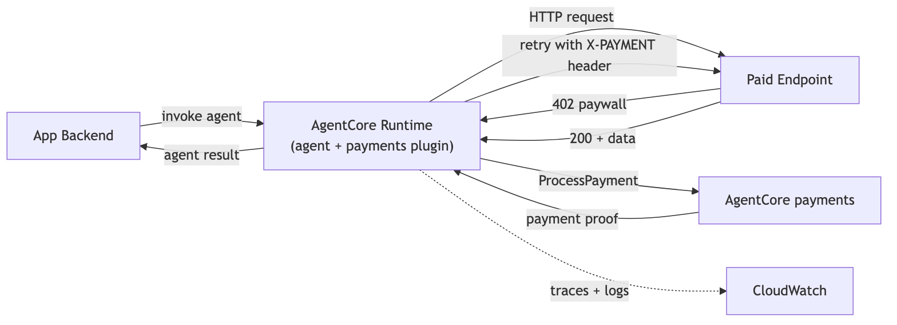
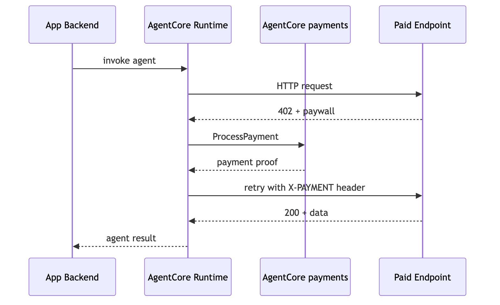

# Tutorial 02 — Deploy a Payment Agent to AgentCore Runtime

| Information         | Details                                                                     |
|:--------------------|:-----------------------------------------------------------------------------|
| Tutorial type       | Runtime deployment                                                          |
| Agent type          | Single, payment-enabled                                                     |
| Agentic Frameworks  | Strands Agents and OpenAI Agents SDK                                        |
| LLM models          | Anthropic Claude Sonnet 4.6 and OpenAI GPT-5.5 on Amazon Bedrock             |
| Components          | AgentCore CLI, AgentCore Runtime, payment plugin/function tool, `PaymentManager` |
| Example complexity  | Intermediate                                                               |

> **Reads** `PAYMENT_MANAGER_ARN`, `USER_ID`, `INSTRUMENT_ID`, `AWS_REGION` from the shared `.env`.
> **Does** deploy either the Strands or OpenAI agent from Tutorial 01 to AgentCore Runtime, mint a
> budgeted session with `PaymentManager`, and invoke the deployed agent over HTTPS.
> → [How the pieces fit together](../README.md#cli-vs-sdk)

## Overview

Tutorial 01 ran payment-enabled agents locally. Here you deploy either the **Strands** agent or the
**OpenAI Agents SDK** agent to **AgentCore Runtime** with the **AgentCore CLI**. The CLI provisions
and invokes the runtime; the SDK creates each request's budgeted payment session. Both variants reuse
the Payment Manager, connector, and wallet instrument from Tutorial 00.

The deployed agent runs under its own execution role. Its `AgentCorePaymentsPlugin` intercepts HTTP 402 responses and calls `ProcessPayment` within the session budget, so the LLM never calls payment APIs directly. All payment context (manager ARN, session, instrument, user) arrives in the invocation payload, keeping the agent stateless — the same deployed binary can serve different users with different budgets.

> **Billable resources.** `agentcore deploy` creates real AWS resources (AgentCore Runtime, IAM execution role, CloudWatch). See [AgentCore pricing](https://aws.amazon.com/bedrock/agentcore/pricing/). First deploy takes a few minutes for IAM role propagation; later deploys are faster.

> **Testnet only.** The agent pays x402 endpoints on Base Sepolia (network `ETHEREUM`) with free testnet USDC from [faucet.circle.com](https://faucet.circle.com/). Testnet USDC has no monetary value.

> **Supported regions:** `us-east-1`, `us-west-2`, `eu-central-1`, `ap-southeast-2`. Set `AWS_REGION` in the shared `.env` to one of these.

## Architecture



```
App Backend                          AgentCore Runtime
  │                                   ┌──────────────────────────┐
  │ create_payment_session($0.50)     │  Payment Agent            │
  │  (PaymentManager SDK)             │  (execution role)         │
  │── invoke(session, instrument) ──►│  Plugin: ProcessPayment   │
  │  (agentcore invoke)               │  Scope: ProcessPayment    │
  │◄── weather data + cost ─────────│   only — spends within the │
  │                                   │   session budget set by    │
  │ get_payment_session(check spend)  │   the backend             │
  │  (PaymentManager SDK)             └──────────────────────────┘
```

### How the agent code works (`payment_agent.py`)

1. **`BedrockAgentCoreApp` + `@app.entrypoint`** — the standard AgentCore Runtime service contract. This file is copied into the scaffolded project as `app/PaymentAgent/main.py`.
2. **Payload-driven config** — the agent reads all payment context (`payment_manager_arn`, `user_id`, `payment_session_id`, `payment_instrument_id`) from the invocation payload. This keeps the agent stateless.
3. **`AgentCorePaymentsPlugin`** — built per request from the payload context (network preferences `eip155:84532` / `base-sepolia`); it intercepts HTTP 402 responses and calls `ProcessPayment` automatically within the session budget.

The OpenAI variant uses the same payload contract. Its thin
`openai_payment_runtime.py` entrypoint reuses Tutorial 01's OpenAI agent and framework-neutral
`x402_fetch` helper, while GPT-5.5 is called through Amazon Bedrock's OpenAI-compatible endpoint.

## Prerequisites

- **Tutorial 00 completed** — the shared `.env` (one directory up, `00-getting-started/.env`) is populated with `PAYMENT_MANAGER_ARN`, `USER_ID`, `INSTRUMENT_ID`, `AWS_REGION`, etc.
- **Tutorial 01 completed** — you understand the local agent + plugin flow.
- **Funded wallet** — the instrument from Tutorial 00 has testnet USDC and delegated signing granted ([faucet.circle.com](https://faucet.circle.com/)).
- **AgentCore CLI** (Node.js 20+): `npm install -g @aws/agentcore`
- **AWS CDK** (used by `agentcore deploy`): `npm install -g aws-cdk`
- **Python 3.10+** and AWS CLI configured (`aws sts get-caller-identity`).
- **OpenAI GPT-5.5 access on Amazon Bedrock** if you deploy the OpenAI variant.

```bash
pip install -r requirements.txt
```

## Walkthrough

Run these steps top to bottom. Steps 1–5 provision and deploy the runtime with the CLI; steps 6–8 mint a budgeted session with the AgentCore SDK and invoke the deployed agent.

### Step 1 — (Optional) test locally before deploying

Confirm the agent starts cleanly on your machine first.

```bash
python payment_agent.py
# In another terminal:
curl -s http://localhost:8080/ping
# Stop the agent (Ctrl+C) before continuing.
```

### Step 2 — Scaffold the AgentCore project

`agentcore create` generates a runtime project (CDK app, Dockerfile, and an `app/PaymentAgent/` package) wired for a Strands agent served over HTTP with a Bedrock model and no memory.

```bash
agentcore create --name PaymentAgent --framework Strands --protocol HTTP --model-provider Bedrock --memory none
cd PaymentAgent
```

### Step 3 — Copy the agent into the project

Replace the scaffold's placeholder entrypoint with your payment agent.

```bash
cp ../payment_agent.py app/PaymentAgent/main.py
```

### Step 4 — Set the project dependencies

The runtime build installs from `app/PaymentAgent/pyproject.toml`. `payment_agent.py` imports `strands_tools`, `dotenv`, and the payments plugin (`bedrock_agentcore.payments.integrations.strands`), so list those libraries in `[project].dependencies`, then remove the stale lock so the build regenerates it with the new deps.

Edit `app/PaymentAgent/pyproject.toml` so its `[project]` dependencies include:

```toml
[project]
name = "payment-agent"
version = "0.1.0"
requires-python = ">=3.10"
dependencies = [
    "bedrock-agentcore[strands-agents]>=1.9.0",
    "strands-agents>=1.0.0",
    "strands-agents-tools>=0.2.0",
    "python-dotenv>=1.0.0",
    "boto3>=1.43.5",
]
```

Then remove the old lock so it is regenerated with these dependencies:

```bash
rm -f app/PaymentAgent/uv.lock
```

### Step 5 — Deploy and attach payment permissions

`agentcore deploy` builds the image and provisions the Runtime, its execution role, and CloudWatch (~2–3 min on first run while IAM roles propagate).

```bash
agentcore deploy -y
agentcore status
```

Tutorial 00 already provisioned the Payment Manager and connector, so this project deploys a plain runtime. After the deploy, attach the payment data-plane permissions the agent needs at request time — `ProcessPayment`, `GetPaymentInstrument`, and `GetPaymentSession` — to the auto-created execution role. Find the role name in the `agentcore status` output (it contains `PaymentAgent` and `Execution`), then attach an inline policy scoped to your payment manager:

```bash
# Replace <EXECUTION_ROLE_NAME> and <PAYMENT_MANAGER_ARN> with your values.
aws iam put-role-policy \
  --role-name <EXECUTION_ROLE_NAME> \
  --policy-name PaymentDataPlaneAccess \
  --policy-document '{
    "Version": "2012-10-17",
    "Statement": [{
      "Effect": "Allow",
      "Action": [
        "bedrock-agentcore:ProcessPayment",
        "bedrock-agentcore:GetPaymentInstrument",
        "bedrock-agentcore:GetPaymentSession"
      ],
      "Resource": [
        "<PAYMENT_MANAGER_ARN>",
        "<PAYMENT_MANAGER_ARN>/*"
      ]
    }]
  }'
```

### Step 6 — Mint a budgeted session (AgentCore SDK)

Sessions are per-request and carry a spend budget, so you create one before each invoke, scoped to the user you serve and the budget you want to allow. The **simplest path** is to let the CLI manage the session for you: `agentcore invoke --auto-session` creates (and reuses) a session with the manager's default spend limit, so you can skip straight to Step 7. When you want to **control the budget explicitly**, mint the session with the AgentCore SDK `PaymentManager` and pass its ID to `agentcore invoke`.

Run this short script from the tutorial directory to mint a $0.50 session and print its ID:

```python
# mint_session.py — creates a budgeted payment session for the invoke in Step 7
import os
from pathlib import Path
from dotenv import load_dotenv
from bedrock_agentcore.payments import PaymentManager

# Load the shared .env (one directory up, at 00-getting-started/.env)
load_dotenv(Path(__file__).resolve().parents[1] / ".env")

REGION = os.environ["AWS_REGION"]
PAYMENT_MANAGER_ARN = os.environ["PAYMENT_MANAGER_ARN"]
USER_ID = os.environ["USER_ID"]

manager = PaymentManager(payment_manager_arn=PAYMENT_MANAGER_ARN, region_name=REGION)

session = manager.create_payment_session(
    user_id=USER_ID,
    limits={"maxSpendAmount": {"value": "0.50", "currency": "USD"}},
    expiry_time_in_minutes=60,
)
print(session["paymentSessionId"])
```

```bash
SESSION_ID=$(python mint_session.py)
echo "$SESSION_ID"
```

Copy the printed `paymentSessionId` for the invoke in Step 7.

### Step 7 — Invoke the deployed agent

This agent reads its payment context from the payload, so pass the manager ARN, user, session, and instrument in the JSON — the agent requires all four. Use the `SESSION_ID` you minted in Step 6. `agentcore invoke` is project-scoped, so run it from inside the scaffolded `PaymentAgent/` directory (where `agentcore.json` lives):

```bash
cd PaymentAgent   # agentcore invoke reads the project config here
agentcore invoke '{"prompt": "Access this paid weather API and tell me what data you get back: https://x402-test.genesisblock.ai/api/weather", "payment_manager_arn": "<MANAGER_ARN>", "user_id": "<USER_ID>", "payment_session_id": "<SESSION_ID>", "payment_instrument_id": "<INSTRUMENT_ID>"}'
```

If you skipped the explicit session in Step 6, let the CLI manage it instead: add `--auto-session` (with `--payment-user-id <USER_ID>`) and `agentcore invoke` creates or reuses a session with the manager's default spend limit, so you omit `payment_session_id` from the payload.

> **This agent is payload-driven.** `handle_request` reads `payment_manager_arn`, `user_id`, `payment_session_id`, and `payment_instrument_id` from the payload dict and returns `{"error": "Missing required fields in payload: ..."}` if any are absent.

### Step 8 — Check the spend (AgentCore SDK)

Confirm the paid call debited the session as expected. This reads the session back with the SDK and prints the remaining budget:

```python
# check_spend.py — reads the remaining budget for the session from Step 6
import os, sys
from pathlib import Path
from dotenv import load_dotenv
from bedrock_agentcore.payments import PaymentManager

# Load the shared .env (one directory up, at 00-getting-started/.env)
load_dotenv(Path(__file__).resolve().parents[1] / ".env")

REGION = os.environ["AWS_REGION"]
PAYMENT_MANAGER_ARN = os.environ["PAYMENT_MANAGER_ARN"]
USER_ID = os.environ["USER_ID"]
SESSION_ID = sys.argv[1]  # pass the session ID from Step 6

manager = PaymentManager(payment_manager_arn=PAYMENT_MANAGER_ARN, region_name=REGION)

session = manager.get_payment_session(user_id=USER_ID, payment_session_id=SESSION_ID)
print("Max budget:      ", session["limits"]["maxSpendAmount"])
print("Available budget:", session["availableLimits"]["availableSpendAmount"])
```

```bash
python check_spend.py "$SESSION_ID"
```

## OpenAI Agents SDK variant

The OpenAI path follows the same role-separated design: a trusted caller creates the bounded
session, and the runtime can only use that existing session.

### 1 — Scaffold and copy the three small source files

Run from this tutorial directory:

```bash
agentcore create \
  --project-name OpenAIPaymentAgent \
  --name OpenAIPaymentAgent \
  --framework Strands \
  --model-provider Bedrock \
  --memory none \
  --protocol HTTP

cp openai_payment_runtime.py OpenAIPaymentAgent/app/OpenAIPaymentAgent/main.py
cp ../01-agents-payments-and-limits/openai_payment_agent.py \
  OpenAIPaymentAgent/app/OpenAIPaymentAgent/openai_payment_agent.py
cp ../01-agents-payments-and-limits/openai_x402_tool.py \
  OpenAIPaymentAgent/app/OpenAIPaymentAgent/openai_x402_tool.py
```

AgentCore CLI 0.22 cannot scaffold the `OpenAIAgents` framework with the Bedrock model provider.
The Strands selection creates the standard Python/Bedrock Runtime shell; the copied entrypoint
replaces the generated agent implementation with the OpenAI Agents SDK implementation.

Add the OpenAI dependencies to the generated app:

```bash
cd OpenAIPaymentAgent/app/OpenAIPaymentAgent
uv add \
  "aws-bedrock-token-generator>=1.1.0" \
  "bedrock-agentcore>=1.18.0" \
  "botocore[crt]>=1.35.0" \
  "httpx>=0.27.1" \
  "openai-agents>=0.19.1" \
  "python-dotenv>=1.0.0"
cd ../../..
```

### 2 — Validate, deploy, and grant runtime access

```bash
cd OpenAIPaymentAgent
agentcore validate
agentcore deploy -y
agentcore status
```

Attach the payment policy from Step 5 to the `OpenAIPaymentAgent` execution role. The OpenAI model
endpoint also needs these two Bedrock Mantle actions:

```bash
aws iam put-role-policy \
  --role-name <OPENAI_EXECUTION_ROLE_NAME> \
  --policy-name OpenAIBedrockAccess \
  --policy-document '{
    "Version": "2012-10-17",
    "Statement": [
      {
        "Sid": "CreateInference",
        "Effect": "Allow",
        "Action": "bedrock-mantle:CreateInference",
        "Resource": "arn:aws:bedrock-mantle:<REGION>:<ACCOUNT_ID>:project/default"
      },
      {
        "Sid": "UseBearerToken",
        "Effect": "Allow",
        "Action": "bedrock-mantle:CallWithBearerToken",
        "Resource": "*"
      }
    ]
  }'
```

`CallWithBearerToken` does not support resource-level scoping, so its wildcard resource is required.
Neither policy grants `CreatePaymentSession`; session creation remains with the caller.

### 3 — Invoke the runtime

Create a session with Step 6, then invoke from the scaffolded project:

```bash
agentcore invoke \
  --runtime OpenAIPaymentAgent \
  --json '{"prompt":"Access this paid endpoint and summarize the result: https://x402-test.genesisblock.ai/api/market-news. Report whether payment succeeded.","payment_manager_arn":"<MANAGER_ARN>","payment_session_id":"<SESSION_ID>","payment_instrument_id":"<INSTRUMENT_ID>","user_id":"<USER_ID>"}'
```

A successful response contains the agent's final answer, reporting HTTP 200 and `payment_made: true`.
The initial HTTP 402 is the expected x402 challenge. The tool generates one proof and replays the GET
once; a repeated 402 or merchant failure reports an unknown payment outcome (`payment_made: null`)
without automatically making another payment. Inspect the session before retrying.

The default OpenAI trace exporter is disabled for this Bedrock-only example. Runtime
CloudWatch/OpenTelemetry instrumentation is configured separately.

## What the agent does

The agent calls the paid weather endpoint with `http_request`. The endpoint returns HTTP 402; the
`AgentCorePaymentsPlugin` intercepts it, settles the payment against the instrument within the
session budget, retries the request, and returns the weather data plus the cost. Its payment policy
can process payments and read the supplied session/instrument, but cannot create sessions, override
the budget, or provision wallets.

The OpenAI variant follows the same flow through its `x402_fetch` function tool and calls GPT-5.5
through Amazon Bedrock rather than using an OpenAI API key.

The full request path — invoke → 402 → `ProcessPayment` → retry → `200` + data — looks like this:



## Inspect / verify

Run these from the scaffolded project directory (`PaymentAgent/`), where the AgentCore project config lives.

```bash
# Runtime status (deployed agent)
agentcore status

# Stream runtime logs
agentcore logs
```

Confirm the Runtime ARN was written to the shared `.env`:

```bash
grep AGENT_RUNTIME_ARN ../../.env
```

CloudWatch GenAI observability dashboard: `https://<region>.console.aws.amazon.com/cloudwatch/home?region=<region>#gen-ai-observability/agent-core`

## Troubleshooting

| Error | Cause | Fix |
|---|---|---|
| `agentcore: command not found` | AgentCore CLI not installed | `npm install -g @aws/agentcore` (Node.js 20+) |
| Deploy build fails on import (`strands_tools` / `dotenv` / payments plugin) | Project `pyproject.toml` missing the agent's dependencies | Add the Step 4 dependencies and `rm -f app/PaymentAgent/uv.lock`, then redeploy |
| Deploy fails with CDK bootstrap error | Account/region not bootstrapped | `cdk bootstrap aws://<account-id>/<region>` |
| `Missing required fields in payload` | Payload missing one of `payment_manager_arn`, `user_id`, `payment_session_id`, `payment_instrument_id` | Include all four fields in the invoke JSON (this agent is payload-driven) |
| Access-denied on `ProcessPayment` after deploy | Execution role lacks payment data-plane permissions | Attach `ProcessPayment`/`GetPaymentInstrument`/`GetPaymentSession` to the execution role with the `aws iam put-role-policy` command in Step 5 |
| Access-denied on `CreateInference` or `CallWithBearerToken` | OpenAI runtime role lacks Bedrock Mantle access | Attach the OpenAI-only policy from the OpenAI variant section |
| `Instrument not found` at invoke | `user_id` doesn't match the instrument's owner | Use the exact `USER_ID` from Tutorial 00's `.env` |
| `Delegated signing grant is not active` | Wallet consent not completed | Complete the funding/delegation step from Tutorial 00 / 03 |

## Clean Up

> **Warning:** Cleanup is irreversible.

```bash
cd PaymentAgent  # or OpenAIPaymentAgent
agentcore remove all -y
```

This deletes the AgentCore Runtime deployment and its AWS resources (CDK stack, CloudWatch logs). Payment sessions expire automatically. The shared Payment Manager, connector, and instrument from Tutorial 00 remain in place — tear those down with Tutorial 00's cleanup. The connector and manager teardown uses the AgentCore CLI (`agentcore remove payment-connector` / `remove payment-manager`, then `agentcore deploy -y` to apply). The instrument is deleted with the AgentCore SDK `PaymentManager` — pass the connector id and user id alongside the instrument id (all read from the shared `.env`):

```python
import os
from pathlib import Path
from dotenv import load_dotenv
from bedrock_agentcore.payments import PaymentManager

# Load the shared .env (one directory up, at 00-getting-started/.env)
load_dotenv(Path(__file__).resolve().parents[1] / ".env")

REGION = os.environ["AWS_REGION"]
PAYMENT_MANAGER_ARN = os.environ["PAYMENT_MANAGER_ARN"]
PAYMENT_CONNECTOR_ID = os.environ["PAYMENT_CONNECTOR_ID"]
INSTRUMENT_ID = os.environ["INSTRUMENT_ID"]
USER_ID = os.environ["USER_ID"]

manager = PaymentManager(payment_manager_arn=PAYMENT_MANAGER_ARN, region_name=REGION)

manager.delete_payment_instrument(
    payment_instrument_id=INSTRUMENT_ID,
    payment_connector_id=PAYMENT_CONNECTOR_ID,
    user_id=USER_ID,
)
```

## Next steps

- **Tutorial 03** — [`../03-user-onboarding-wallet-funding/`](../03-user-onboarding-wallet-funding/) — Per-user wallet onboarding, funding, delegation, balance checks (SDK).
- **Tutorial 04** — [`../04-agent-with-coinbase-bazaar-via-gateway/`](../04-agent-with-coinbase-bazaar-via-gateway/) — Discover paid MCP tools via AgentCore Gateway (CLI + SDK).
